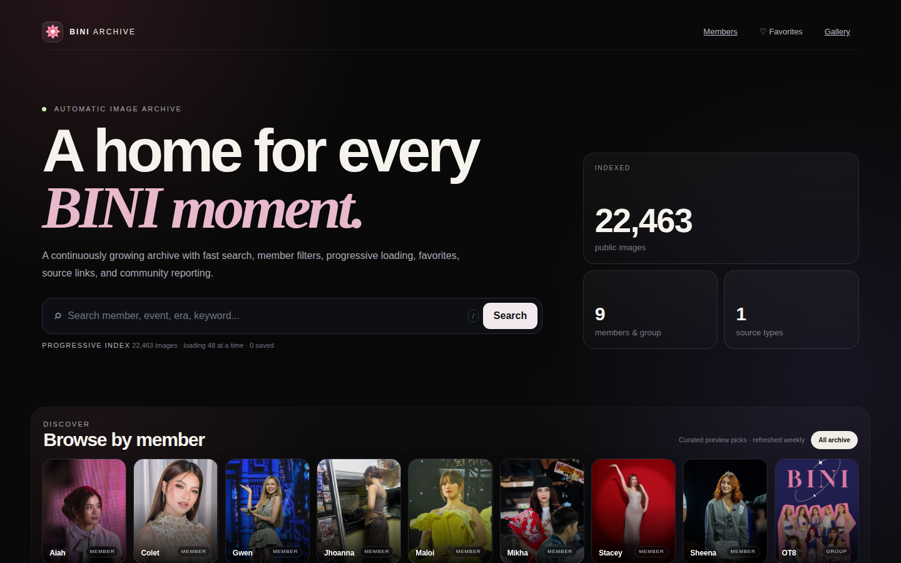
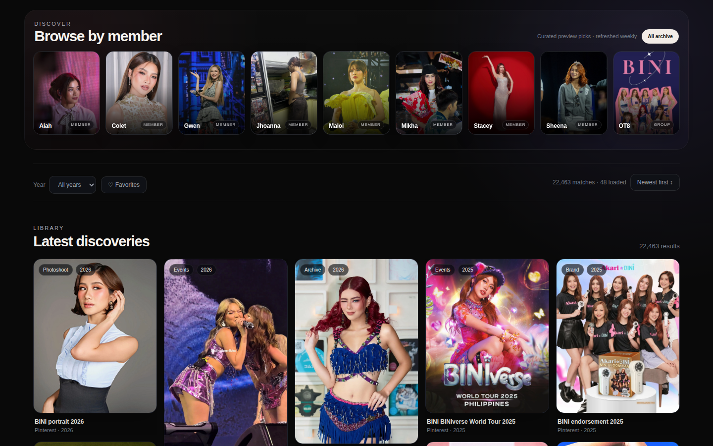
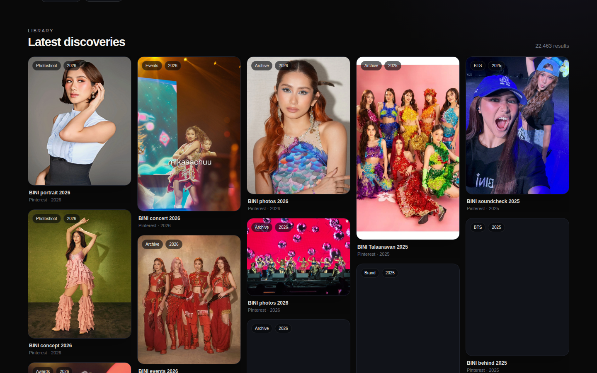
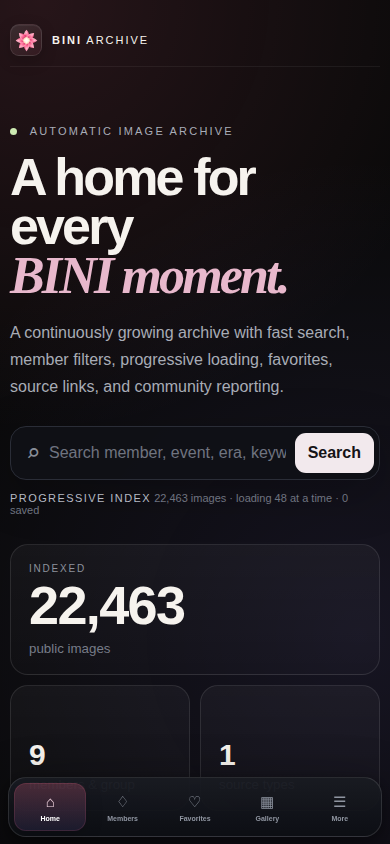
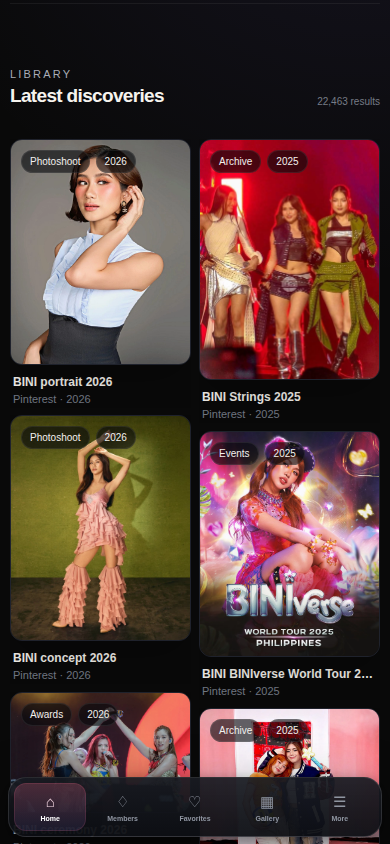

<div align="center">


# BINI Image Archive

### A polished, searchable home for BINI moments.

Browse by member, year, source, or keyword with progressive loading, favorites, community reporting, and a private moderation workspace.

<p>
  <a href="https://bini-image-archive.vercel.app">
    <strong>🌸 Open Live Archive</strong>
  </a>
  &nbsp;&nbsp;·&nbsp;&nbsp;
  <a href="#features">Features</a>
  &nbsp;&nbsp;·&nbsp;&nbsp;
  <a href="#development">Development</a>
</p>

<p>
  
  
  
  
  
</p>

</div>

---

## ✨ Preview

### Desktop

<p align="center">
  
</p>

### Browse by member

<p align="center">
  
</p>

### Gallery

<p align="center">
  
</p>

### Mobile

<p align="center">
  
  &nbsp;&nbsp;
  
</p>

---

## 🌸 What is BINI Image Archive?

**BINI Image Archive** is a continuously growing image archive focused on fast discovery and a smooth browsing experience.

The interface is designed to make a large collection feel simple:

**discover → filter → browse → view → save → report**

The public experience is backed by a private operations system for moderation, reports, crawler monitoring, analysis, and storage health.

---

## ✨ Features

### 🔎 Search & Discovery

Search the archive using:

- member
- year
- keyword
- source
- archive metadata

The homepage also provides curated member previews for quick browsing.

### 👥 Member Browsing

Browse directly through:

**Aiah · Colet · Gwen · Jhoanna · Maloi · Mikha · Stacey · Sheena · OT8**

Selecting a member immediately filters the archive and moves the user toward the gallery.

### ⚡ Progressive Loading

The archive is designed for a large collection.

Instead of rendering the entire library immediately, images are loaded progressively in batches to keep the interface responsive.

### ♡ Favorites

Favorites work without accounts.

Saved images are stored locally in the browser and can be opened from the public navigation.

### 🚩 Community Reports

Visitors can report problematic images, including:

- unrelated content
- wrong member
- duplicate
- low quality
- wrong context
- other issues

Reports are sent to the private moderation workspace.

### 🛡️ Review Studio

Moderators can work through:

- Needs Review
- Audit All
- Kept
- Rejected
- Reports

The review workflow also supports batch moderation and quick actions.

### 🖥️ Admin Control Center

The private operations dashboard provides visibility into:

- crawler state
- worker checkpoints
- review queue
- library health
- analyzer state
- duplicate analysis
- activity
- storage
- settings

### 📱 Responsive UI

The public archive and admin tools are designed for:

- desktop
- laptop
- tablet
- mobile
- small phones

The mobile interface uses touch-friendly navigation and compact controls instead of simply shrinking the desktop layout.

---

## 🏗️ Architecture

```text
                         ┌────────────────────────────┐
                         │      Next.js Application   │
                         │                            │
                         │  Public Archive UI         │
                         │  Admin Control Center      │
                         │  Review Studio             │
                         └─────────────┬──────────────┘
                                       │
                  ┌────────────────────┼────────────────────┐
                  │                    │                    │
                  ▼                    ▼                    ▼
           /api/images          /api/reports       /api/internal/*
                  │                    │                    │
                  └────────────────────┼────────────────────┘
                                       │
                                       ▼
                         ┌────────────────────────────┐
                         │       Cloudflare R2        │
                         │                            │
                         │  Image Objects             │
                         │  Persistent State          │
                         │  Moderation State          │
                         │  Reports                   │
                         │  Crawler Checkpoints       │
                         └─────────────▲──────────────┘
                                       │
                         ┌─────────────┴──────────────┐
                         │       GitHub Actions       │
                         │                            │
                         │  Parallel Crawler          │
                         │  Merge / Checkpoints       │
                         └────────────────────────────┘
